# Inventory Forecasting — Management and User Guide

Current-state guide for the system as re-audited on **4 September 2026**.

For the meeting-ready materials, use:

- [Editable PowerPoint](presentations/inventory-forecasting-management-presentation.pptx)
- [PDF handout](presentations/inventory-forecasting-management-presentation.pdf)
- [Presenter notes](presentations/inventory-forecasting-presenter-notes.md)
- [Reusable process-infographic images](presentations/images/)

## 1. Executive summary

Inventory Forecasting is now a **read-only prediction and management-analytics
layer** over the BuyAbans back office. BuyAbans remains the system of record for
catalog, current stock and orders. This application pulls that data through an
authenticated API, normalizes it, reconstructs daily demand, forecasts what is
likely to sell and presents evidence for management review.

It is deliberately **not** a second stock-operation system. The application has
no create, edit or delete routes for business data and sends no catalog, stock
or order updates back to BuyAbans.

The current forecasting path is integrated and uses synchronized BuyAbans
demand. The current recommendation engine and several legacy analytics still
read the old local inventory ledger or related historical tables. Their
workflow is implemented, but their present figures must not be represented as
current BuyAbans decisions until the stock-location mapping is resolved.

## 2. The complete process

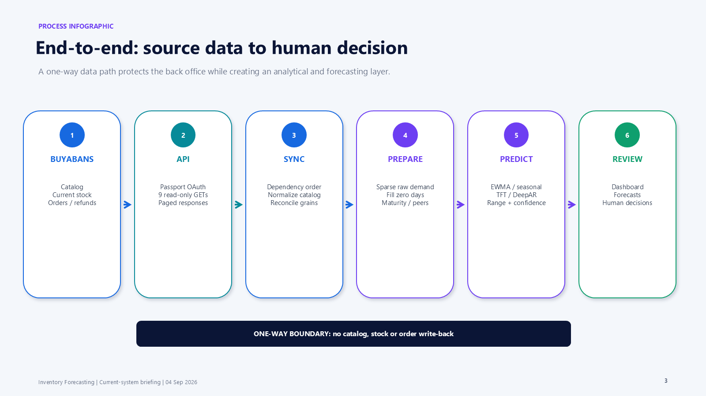

1. BuyAbans exposes catalog, current stock and order outcomes through nine
   Passport-protected `GET` endpoints.
2. The synchronization service imports dependencies in order and records every
   success or failure.
3. Products are rebuilt as parents, variants and standalone products; common
   variant attributes are normalized.
4. Sparse daily sales rows are converted into complete daily series by filling
   zero-sale days.
5. Laravel chooses a history source and algorithm for each SKU/location pair.
6. Python serves EWMA, seasonal naive, TFT or DeepAR.
7. The dashboard and forecast page explain the result; later actual demand is
   used to score accuracy.
8. Recommendation decisions remain human-controlled and do not write back to
   BuyAbans.

## 3. Responsibility boundary

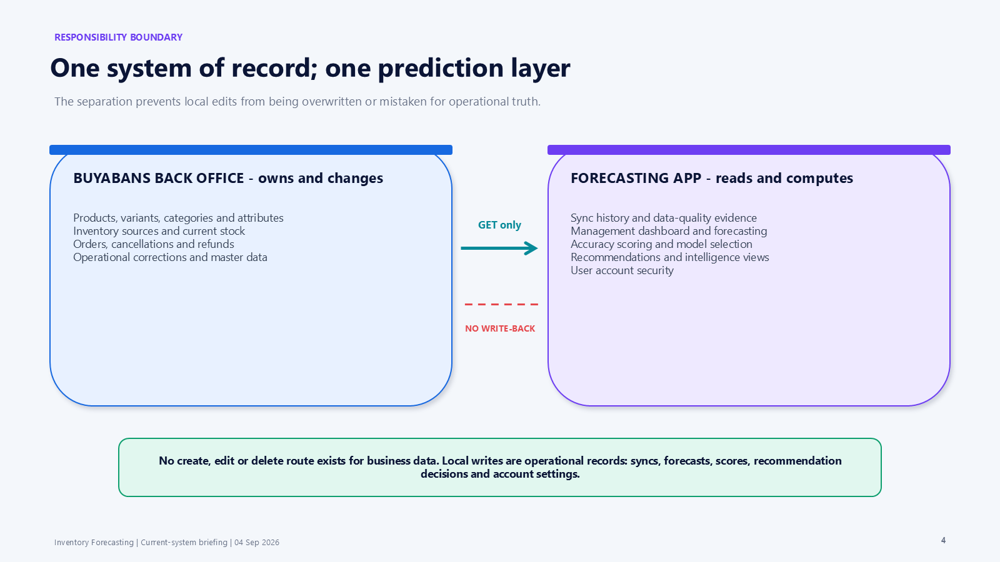

| BuyAbans owns | Inventory Forecasting computes |
| --- | --- |
| Products, variants, categories, brands and attributes | Synchronized analytical copies and run history |
| Inventory sources and current stock | Management dashboard |
| Orders, cancellations and refunds | Demand forecasts and uncertainty |
| Operational correction and master-data maintenance | Accuracy scores and model selection evidence |
| The authoritative business record | Recommendation workflow and intelligence views |

Local writes are limited to the forecasting application's own operations:

- sync attempts and connection tests;
- forecast runs and persisted predictions;
- accuracy scoring after a horizon has elapsed;
- snapshot, supplier-performance and recommendation computations;
- Accept, Modify and Reject recommendation decisions;
- profile, password, 2FA and passkey changes.

Suppliers and promotions are read-only too. Neither currently has a source in
the BuyAbans forecasting API, so those values remain whatever is already stored
locally until a source is agreed.

## 4. Access and navigation

All business pages require an authenticated account with a verified email.
Account features include password reset, password confirmation, TOTP two-factor
authentication and passkeys. Profile, Security and Appearance are reached from
the top-right user menu.

There is no role or permission package. Every authenticated, verified user has
the same broad business visibility and access to operational triggers.

### Current sidebar

| Group | Pages |
| --- | --- |
| Overview | Dashboard, BuyAbans Sync |
| Catalog | Products, Variants, SKUs, Categories, Brands, Attributes |
| Inventory | Inventory, Analytics, Batches, Daily Snapshots, Warehouses |
| Supply | Suppliers |
| Forecasting | Forecasts, Forecast Runs, Recommendations, Central Allocation |
| Advanced intelligence | Supplier Performance, Lost Sales, Demand Anomalies, Product Similarity, Cannibalization, Successors, Price Elasticity, Promotions |

Historical purchase-order, receipt, transfer, sales, return and stock-movement
listings remain reachable by direct URL so old data remains readable. They are
not navigation and have no write route.

## 5. BuyAbans synchronization

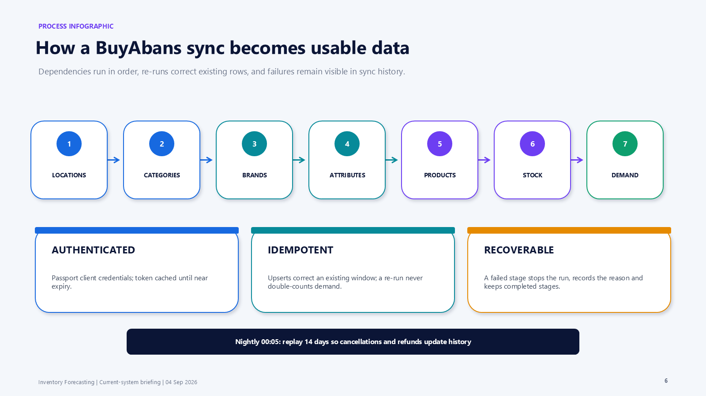

The `/buyabans-sync` page provides:

- **Test connection** — checks credentials and source counts without importing;
- **Sync now** — runs one stage or all stages for a chosen date window and
  location grain;
- current synchronized category, brand, SKU and warehouse counts;
- demand-history totals by grain;
- full success/failure history with duration, counts and error detail.

Stages run in this order: locations, categories, brands, attributes, products,
current stock, demand. A failure stops later stages but keeps completed work.

Synchronization is idempotent. Re-running a covered window corrects existing
rows rather than double-counting. The nightly schedule intentionally re-pulls
14 days because cancellations and refunds can change past demand.

### Three demand grains

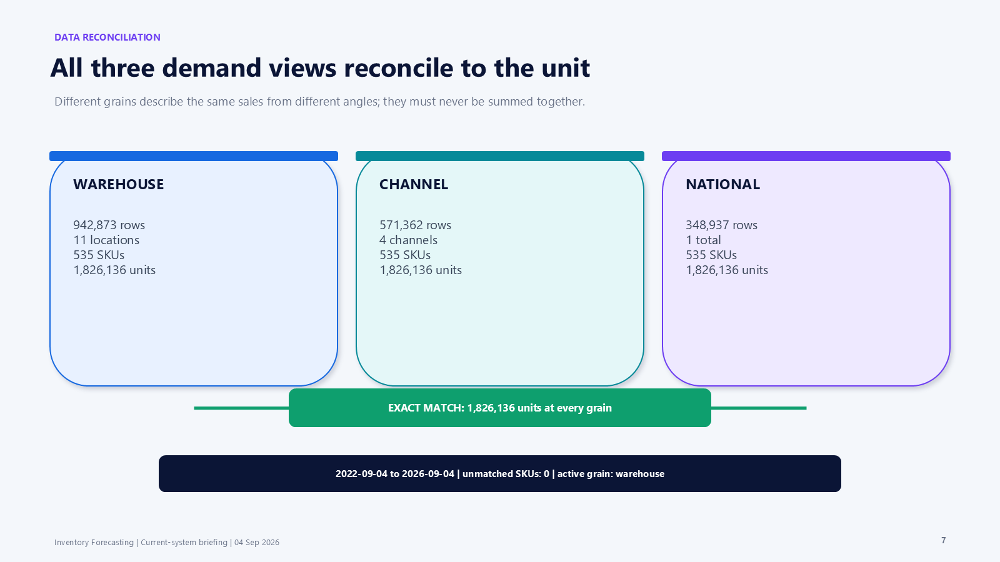

| Grain | Rows | Locations | SKUs | Units |
| --- | ---: | ---: | ---: | ---: |
| Warehouse | 942,873 | 11 | 535 | 1,826,136 |
| Channel | 571,362 | 4 | 535 | 1,826,136 |
| National | 348,937 | 1 | 535 | 1,826,136 |

All three cover 2022-09-04 through 2026-09-04 and contain zero unmatched demand
SKUs. Their equal unit totals prove that they are complete alternative
aggregations of the same sales.

`BUYABANS_GRAIN=warehouse` is the current serving and training grain. Different
grains must never be added together.

## 6. Catalog normalization

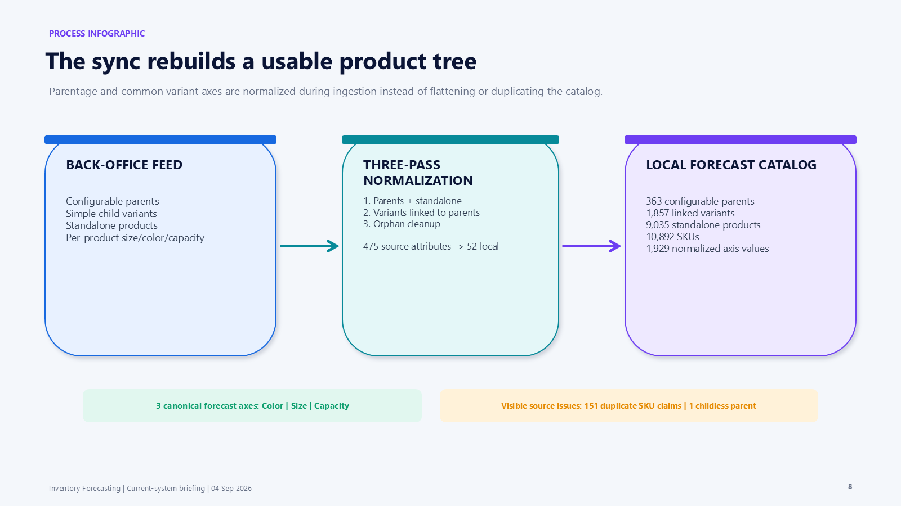

The product synchronization reconstructs the Bagisto product tree instead of
flattening child variants:

- 363 configurable parents;
- 1,857 linked variants;
- 9,035 standalone products;
- 10,892 SKUs;
- 1,929 normalized variant-axis values.

BuyAbans defines many per-product versions of Color, Size and Capacity. The
sync reduces 475 source attributes to 52 local attributes and maps these three
concepts to common forecast-relevant axes.

Source-data conflicts are visible in the sync summary. The current source has
151 duplicate SKU claims and one childless configurable parent. The sync does
not guess which duplicate product should own a SKU.

## 7. Demand quality and time-series preparation

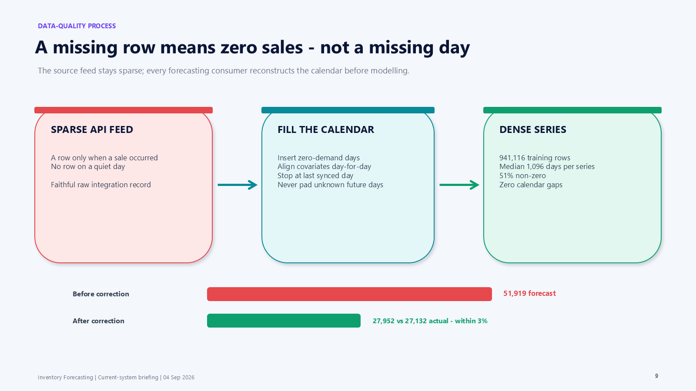

The source sales aggregate contains a row only for a day on which something was
sold. A day with no row is therefore a zero-demand day, not a missing time
interval.

Every forecasting consumer reconstructs the calendar before modelling:

- insert zero-demand days between observations;
- align covariates to the same calendar;
- continue to the last synchronized day;
- never pad from the last synchronized day to today, because those days are
  unknown rather than zero.

The correction changed one comparable run from 51,919 forecast units against
27,132 actual to 27,952 against 27,132 — from 91% too high to within 3%.

The current dense training export has 941,116 rows, median series length 1,096
days, 51% non-zero observations and no calendar gaps.

## 8. Dashboard

`/dashboard` is computed on request from the latest synchronized data.

### Trading, 30 days

- Revenue
- Units sold
- Orders
- Average order value

Each includes a 12-week sparkline and a comparison of the latest four weeks
with the preceding four weeks.

### Stock position

- Stock on hand at **retail** value
- Days of cover
- Lines out of stock
- Pending reorder alerts

Retail valuation is explicit because cost is populated for only 149 of 10,892
SKUs. Days of cover combines current back-office stock with generated demand,
so it demonstrates the calculation rather than real business coverage.

### Charts and forecast health

- units and revenue per week on separate charts;
- revenue by category and warehouse;
- top movers by unit volume;
- fixed cover-health bands;
- latest forecast run, horizon, product coverage and scored accuracy.

Every window ends on the last synchronized demand date. A missing metric renders
as “—”, never zero. Forecast accuracy stays absent until a completed horizon is
scored. Current measured dashboard response time is about 2.5 seconds, reduced
from 70.4 seconds after index and query corrections.

## 9. Forecasts

`/forecast` is designed for a non-technical reader. Before the detailed table,
it explains:

- expected units over the forecast horizon;
- comparison with the preceding equal-length window;
- lower and upper likely range;
- product coverage and confidence;
- twelve weeks of observed sales followed by a forecast weekly average;
- the products expected to sell most;
- the history basis used for each group.

The latest logged example showed 31,365 expected units, 30,445 in the preceding
window, a likely range of 19,314–44,287, 533 products and Low confidence. These
figures use generated demand history and are not a production prediction claim.

The table defaults to the latest run and asks business questions: Expected to
sell, Over, How sure, Based on and How it turned out. Older runs are available
only when explicitly requested.

## 10. Forecasting process and algorithm governance

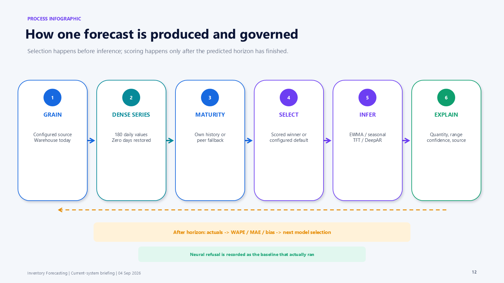

For each SKU/location pair:

1. Read the configured source and location grain.
2. Build a dense daily series.
3. Classify product maturity.
4. Use the SKU's own history, a peer profile, or a blend for an early product.
5. Choose a scored winner when enough comparable accuracy exists; otherwise use
   the configured default.
6. Run EWMA, seasonal naive, TFT or DeepAR.
7. Store predicted quantity, lower and upper bounds, confidence, source and the
   algorithm that actually ran.
8. After the horizon ends, compare actual demand and store WAPE, MAE and bias.

If a neural algorithm cannot honestly serve a pair, the Python service returns
a baseline and an explanation. Laravel records that baseline as the algorithm
that actually ran.

### Current evidence

The latest saved 30-day cross-model evaluation
(`ml-service/models/evaluation.json`, 11 windows, pooled over the horizon
total) selects **seasonal naive**:

| Algorithm | WAPE | Position |
| --- | ---: | --- |
| Seasonal naive | 30.7% | Best |
| EWMA | 32.2% | Second |
| DeepAR | 47.0% | Third |
| TFT | 47.2% | Fourth |

The final neural artifacts were regenerated with a 365-day holdout. The
training summary records TFT at 98.3% WAPE with -2.4% bias and DeepAR at 102.0%
WAPE with +12.6% bias.

All available demand evidence is generated. The configuration keeps
`ML_DEFAULT_ALGORITHM=ewma`, which this evaluation places second by 1.6
percentage points rather than first — the default has not been revisited since
the evaluation was last re-run. A switch to a neural default requires real
history and completed-horizon evidence.

## 11. Recommendations — implemented workflow, unresolved data mapping

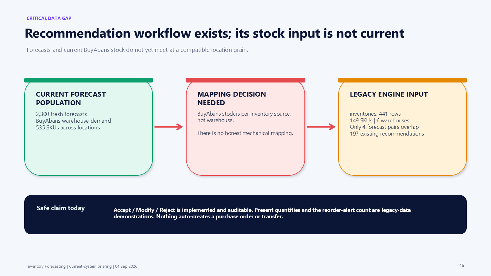

The recommendation engine can calculate Purchase, Reduce purchase, Do not
reorder, Transfer stock and Clearance. A reviewer can Accept, Modify with a
reason, or Reject. These are auditable decisions; they never automatically
create a purchase order, transfer or write-back.

The present input is not current BuyAbans inventory:

- latest forecast run: 2,300 predictions;
- legacy `inventories`: 441 rows, 149 SKUs, six warehouses;
- current overlap: four forecast pairs;
- existing recommendations: 197, based on that legacy ledger.

BuyAbans reports current stock by inventory source, while recommendations were
designed for warehouses. Management must define the source-to-location mapping
or approve a recommendation-grain redesign before these quantities become
current business signals. The Dashboard reorder-alert count has the same
limitation.

## 12. Advanced intelligence and data lineage

The system contains supplier performance, lost-sales estimation, demand
anomalies, product similarity, cannibalization candidates, successor
candidates, price elasticity and promotion impact.

Their logic and UI are implemented, but several read local snapshots,
movements, purchasing or sales tables that the BuyAbans sync does not populate.
Treat them as delivered capabilities and a migration roadmap. Do not imply that
all current figures are driven by the live synchronized path.

Current BuyAbans-backed views are the dashboard, forecast training and serving,
maturity and peer profiles, catalog, variants, attributes and current stock.

## 13. Automation and operations

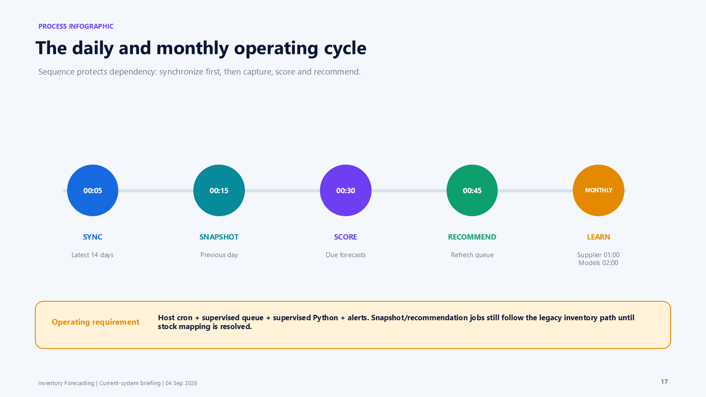

| Time | Task |
| --- | --- |
| Daily 00:05 | Synchronize the latest 14 BuyAbans days |
| Daily 00:15 | Capture the previous day's inventory snapshot |
| Daily 00:30 | Score forecasts whose horizons have elapsed |
| Daily 00:45 | Generate recommendations |
| Monthly, day 1 at 01:00 | Capture supplier performance |
| Monthly, day 1 at 02:00 | Retrain neural models in the background |

A production deployment needs host cron, a supervised queue worker, a
supervised Python service and monitoring. The forecast job and listener allow
1,800 seconds because a widened run takes longer than the framework's previous
60-second listener limit.

## 14. Technical architecture

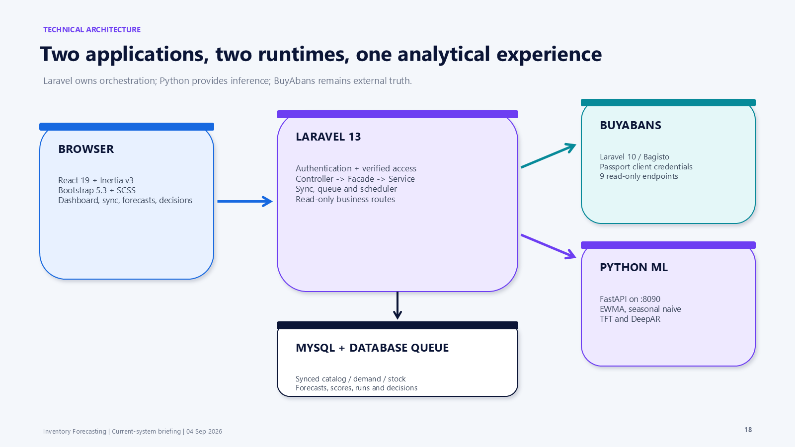

- Laravel 13, PHP 8.3+, Inertia v3, React 19, TypeScript, Bootstrap 5.3 and SCSS.
- Thin Controller → Facade → Service → Model architecture.
- MySQL for application data and a database-backed queue locally.
- Separate BuyAbans Laravel/Bagisto application with Passport client
  credentials and nine read-only endpoints.
- Separate Python FastAPI service on port 8090 serving four algorithms.

The widened run produced 2,300 forecasts in 2m22s. The Dashboard is about 2.5s
and the Forecast page about 0.9s after index and date-range work.

## 15. Security and control position

### Delivered

- verified-email access;
- password reset and confirmation;
- TOTP two-factor authentication;
- passkeys;
- login and challenge throttling;
- read-only business-data HTTP surface;
- OAuth machine identity for BuyAbans;
- idempotent sync and failure history;
- grain-isolation tests and exact reconciliation;
- explicit neural fallback;
- human recommendation decision records.

### Required before production

- role-based permissions and controlled account provisioning;
- production BuyAbans URL, Passport client and network access;
- stock source-to-location mapping for recommendations;
- real mail and reviewed cookie/session settings;
- protected and rotated API credentials and ML tokens;
- database/cache/queue provisioning;
- backups and restore testing;
- supervised queue, scheduler and Python processes;
- logs, metrics, alerts and release validation.

## 16. Verification and evidence boundary

Latest logged assurance:

- Pest: 253/253;
- Python service: 62/62 in the last fully logged suite;
- current source: 36 models, 43 migrations, 34 services, 33 facades and 45
  React pages;
- three demand grains reconciled exactly;
- zero unmatched demand SKUs;
- 2,300 forecasts completed in 2m22s.

These facts prove implementation and integration. They do not prove adoption,
production reliability or model accuracy on real sales. The neural training
orchestration is not an automated CI test, and the present recommendation data
does not use current BuyAbans stock.

## 17. Management decisions

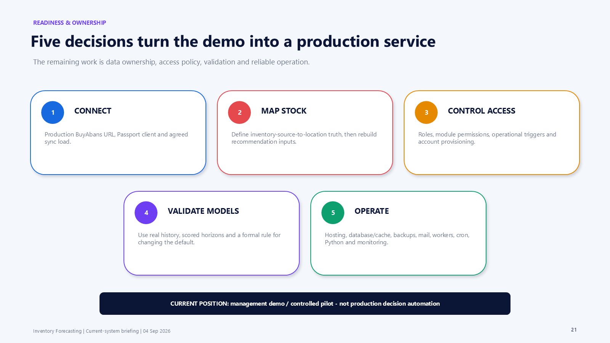

1. Approve production BuyAbans connectivity, credentials and synchronization
   load.
2. Define the authoritative relationship between inventory sources and
   recommendation locations.
3. Define roles, module visibility, operational triggers and account
   provisioning.
4. Approve a real-history validation and model-promotion policy.
5. Choose and operate hosting, database/cache, backups, mail, workers, cron,
   Python and monitoring.

Until these have owners, the correct position is **management demo or
controlled pilot**, not production decision automation.

## 18. Suggested live demonstration

1. Dashboard — management coverage and date anchoring.
2. BuyAbans Sync — source provenance, stage order and run history.
3. Products and Variants — the product tree and normalized axes.
4. Forecasts — expected volume, comparison, range, confidence and basis.
5. Forecast Runs — queued processing and the completed widened run.
6. Recommendations — the human workflow and the current stock-source gap.

## 19. Troubleshooting

| Symptom | Check |
| --- | --- |
| Dashboard has no data | Verify BuyAbans Sync history and configured grain |
| Sync connection fails | API URL, Passport client id/secret, network access and signing keys |
| Sync remains Running | The previous PHP process may still exist; stop the actual child process before retrying |
| Forecast run remains Queued | A queue worker is not running |
| Forecast run remains Processing | Worker/listener timeout and stale-run monitoring |
| Forecast run fails | Python `/health`, Laravel ML URL and matching bearer tokens |
| Forecast totals are unexpectedly high | Confirm dense zero-day reconstruction and one-grain isolation |
| Forecast accuracy is “—” | The horizon has not elapsed or accuracy scoring has not run |
| Recommendations cover few products | Expected until BuyAbans stock mapping replaces the legacy inventory input |
| Email does not arrive | Local mail is logged; production needs a real mail transport |

## 20. Related documentation

- [Application guide](app_guide.md)
- [Application architecture](app_architecture.md)
- [Server architecture](server_architecture.md)
- [Task and decision history](task_log.md)
- [ML service README](../ml-service/README.md)
