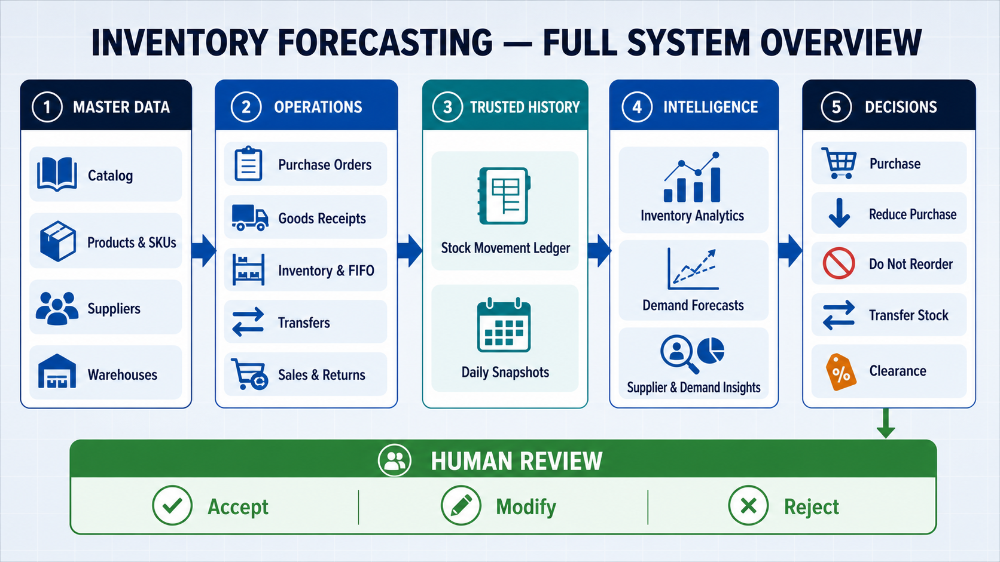
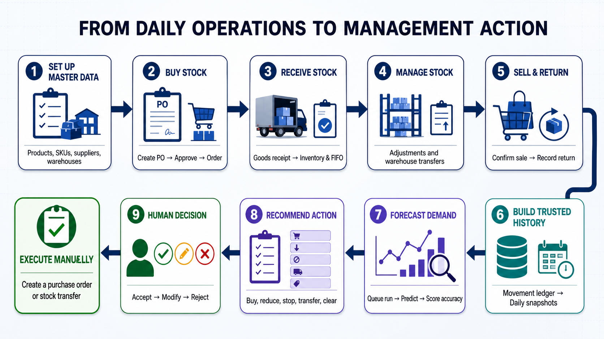
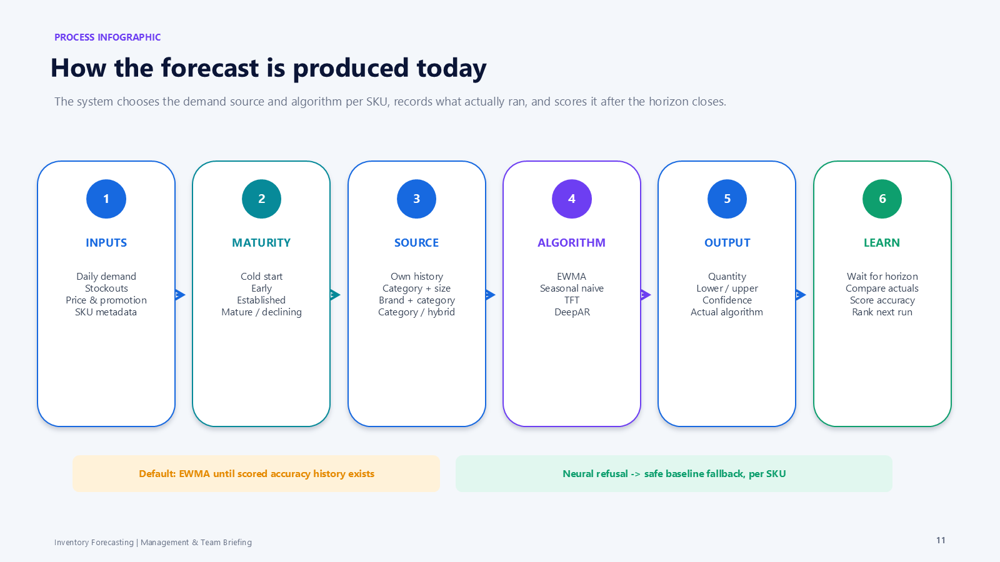
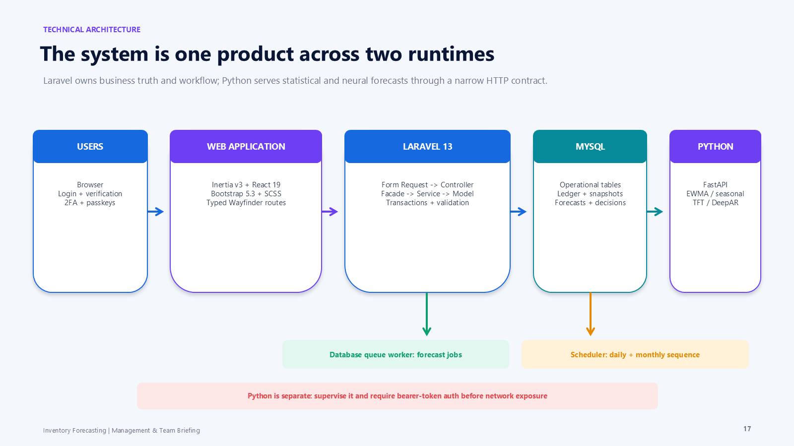
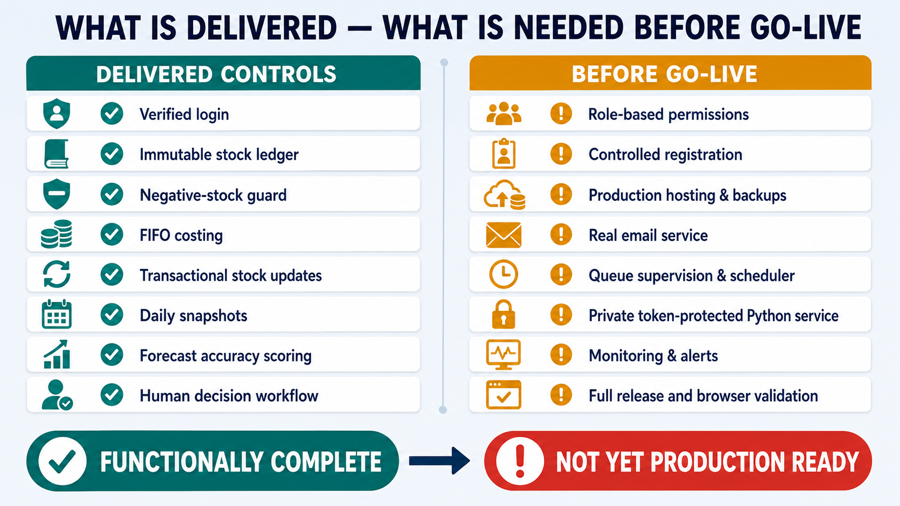

# Inventory Forecasting — Management and User Guide

**Audience:** Management, inventory planners, purchasing teams, warehouse
teams, sales operations, analysts, system administrators, and project sponsors

**System reviewed:** Inventory Forecasting application as implemented on
2026-09-03

**Purpose:** Explain in plain language what was delivered, how the application
should be used, what business controls it provides, and what must still be
completed before a production rollout.

> **Important status statement:** The planned ten-phase application has been
> implemented in functional form and tested extensively. It is not yet a
> production-deployed system. Forecasting can serve two transparent statistical
> baselines plus trained TFT and DeepAR models, selected per SKU, but EWMA remains
> the configured default because the neural models were trained on generated
> rather than real sales history. The application also has no role-based
> permissions: any registered, verified user can currently access every business
> module. These points should be resolved or formally accepted before live
> operational use.

---

## 1. Executive summary

Inventory Forecasting is a browser-based operations platform that brings
product catalog data, warehouse stock, purchasing, receiving, transfers,
sales, returns, historical inventory, demand analysis, forecasting, and stock
recommendations into one system.

The core business chain is working:

```text
Catalog and supplier setup
          ↓
Purchasing, receiving, sales, returns, transfers, and adjustments
          ↓
Immutable stock-movement history + current inventory + FIFO batches
          ↓
Daily inventory and demand snapshots
          ↓
Demand forecasts and forecast-accuracy history
          ↓
Purchase / reduce / do-not-reorder / transfer / clearance recommendations
          ↓
Human Accept / Modify / Reject decision
          ↓
Manual execution through a purchase order or stock transfer
```

The application helps management answer questions such as:

- What stock is available in each warehouse?
- Why did a stock balance change?
- Which purchase orders are outstanding or partially received?
- Which products are fast, slow, or dead movers?
- Which items are likely to run out, become overstocked, or age badly?
- Should stock be purchased, reduced, transferred, or cleared?
- How accurately did previous forecasts perform?
- Are suppliers meeting their expected lead time and quantity commitments?
- Were sales probably lost because an item was out of stock?
- Did a promotion increase demand?
- Which products appear similar, may be replacing one another, or may be
  cannibalizing one another?

### Presentation diagram pack

The following five diagrams are designed to be shown in order during a
management presentation. Each diagram answers one business question and keeps
the explanation focused on outcomes rather than implementation details.

For the complete, current presentation package, use the editable
[`PowerPoint deck`](presentations/inventory-forecasting-management-presentation.pptx),
the [`PDF handout`](presentations/inventory-forecasting-management-presentation.pdf),
and the detailed
[`presenter notes`](presentations/inventory-forecasting-presenter-notes.md).
Nine reusable 16:9 process infographics are available under
[`presentations/images/`](presentations/images/).

#### Diagram 1 — What does the complete system cover?



**How to explain it:** The application connects master data and daily
transactions to a trusted stock history. That history supports forecasting and
recommendations, but a person remains responsible for accepting, modifying, or
rejecting every proposed action.

#### Diagram 2 — How does daily work become a management action?



**How to explain it:** Teams set up the catalog, buy and receive stock, manage
warehouse balances, and record sales and returns. The system turns those real
transactions into history, forecasts, and recommendations. Accepted actions
are then executed through the normal purchase-order or transfer process.

#### Diagram 3 — How is a forecast converted into a decision?



**How to explain it:** The system adapts the demand source for new items, then
selects per SKU from EWMA, seasonal naive, TFT, and DeepAR. Until scored accuracy
history exists, `ML_DEFAULT_ALGORITHM` supplies the default and currently remains
EWMA. A neural model that cannot honestly serve a specific SKU returns a safe
baseline, and the forecast records the algorithm that actually ran.

#### Diagram 4 — What services must operate together?



**How to explain it:** Users work through one browser application. Laravel and
React provide the business screens, MySQL stores the operational record, a
queue worker processes forecast jobs, and a separately running Python service
serves both statistical and trained neural algorithms. The scheduler runs the
daily snapshot, accuracy, and recommendation sequence plus monthly supplier
capture and neural retraining.

#### Diagram 5 — What is delivered, and what remains before go-live?



**How to explain it:** The core operational and decision controls are
functionally delivered. Production use still requires access-role design,
controlled registration, hosting and backups, real email, supervised workers
and scheduling, protection of the Python service, monitoring, and full release
validation.

### Delivery status at a glance

| Area | Status | Management meaning |
| --- | --- | --- |
| Product and SKU master data | Implemented | Categories, brands, attributes, products, variants, and SKUs can be maintained. |
| Multi-warehouse inventory | Implemented | Current balances, movements, FIFO batches, adjustments, and transfers are supported. |
| Purchasing and receiving | Implemented | Supplier terms, purchase-order workflow, partial receipts, and incoming stock are tracked. |
| Sales and returns | Implemented | Draft/confirmed sales and sellable/damaged returns affect stock correctly. |
| Inventory analytics | Implemented | Velocity, days of stock, turnover, age, ABC class, movement speed, and a basic reorder point are available. |
| Historical data pipeline | Implemented | Daily balances, demand, stockout time, and inventory value are captured. |
| Forecasting | Implemented with four algorithms | End-to-end Laravel-to-Python processing serves EWMA, seasonal naive, TFT, and DeepAR with per-SKU fallback. EWMA remains the default pending evidence from real sales history. |
| Inventory recommendations | Implemented | Five actionable recommendation types and a human decision workflow are available. |
| Multi-location planning | Implemented, basic | Full-coverage single-source transfers and central purchase allocation are supported. |
| Advanced intelligence | Implemented | Supplier, demand, product relationship, pricing, and promotion insights are available. |
| Authentication and account security | Implemented | Email verification, password reset, 2FA, passkeys, and account settings are available. |
| Role-based access | **Not implemented** | All verified users currently have broad access; this is a production blocker. |
| Management dashboard data | **Not connected** | The dashboard layout exists, but its KPI cards and charts currently show empty states. |
| Production deployment | **Not implemented** | Hosting, backups, real email, worker supervision, cron, and ML-service hosting still need decisions. |

---

## 2. What was delivered

The implementation followed the ten phases in the project plan.

| Phase | Delivered capability |
| --- | --- |
| 1 — Foundation | Catalog, warehouses, current inventory, stock adjustments, and an append-only movement ledger |
| 2 — Sales and purchasing | Suppliers, purchase orders, goods receipts, transfers, sales orders, returns, and FIFO batches |
| 3 — Inventory analytics | Historical, non-forecast metrics for stock health and replenishment |
| 4 — Data pipeline | Daily inventory/demand snapshots and stockout-duration history |
| 5 — Forecast service | Queued forecast runs, Python service integration, forecasts, model records, and accuracy scoring |
| 6 — Cold-start intelligence | New-item maturity detection and category/brand/size fallback demand profiles |
| 7 — Inventory optimization | Dynamic safety stock, reorder calculations, order quantities, and human decisions |
| 8 — Ageing prevention | Ageing and overstock risk, reduced purchase, do-not-reorder, and clearance actions |
| 9 — Multi-location optimization | Cross-warehouse transfer matching and central purchase allocation |
| 10 — Advanced intelligence | Per-SKU algorithm selection, supplier performance, lost sales, anomalies, product relationships, price elasticity, and promotion impact |

The current source contains 33 Eloquent models, 31 business service/facade
pairs, 38 database migrations, and 71 React page files. The most recent fully
logged suites passed 254 Pest tests and 62 Python tests.

---

## 3. Who should use the system

The following responsibility split is recommended for operating the system.
It is an organizational control only; the application does **not** currently
enforce these roles.

| Suggested responsibility | Typical work in the application |
| --- | --- |
| System administrator | Create/manage user access, configure the environment, monitor services, and manage backups |
| Catalog data owner | Maintain categories, brands, attributes, products, variants, and SKUs |
| Warehouse operator | Record opening stock and adjustments, receive goods, dispatch/receive transfers, and investigate movement history |
| Purchasing officer | Maintain supplier terms, create and progress purchase orders, and act on accepted purchase recommendations |
| Sales operations | Create and confirm sales orders and record sales returns |
| Inventory planner | Review analytics, run forecasts, generate recommendations, and accept/modify/reject proposed actions |
| Management reviewer | Review stock risk, supplier performance, central allocation, exceptions, and promotion outcomes |

Until role-based permissions are added, management should restrict account
creation and use written operating procedures to separate these duties.

---

## 4. Getting access and signing in

### 4.1 Account flow

1. Open the application address supplied by the system administrator.
2. Register with a name, email address, and password, or use an account created
   for you.
3. Verify the email address using the verification message.
4. Sign in and open the application dashboard.
5. For stronger security, open **Account → Security** and enable two-factor
   authentication or register a passkey.

The application supports password reset, email verification, password
confirmation, authenticator-app two-factor codes, recovery codes, and passkeys.

### 4.2 Account settings

| Page | Use |
| --- | --- |
| Profile | Change name or email and, when necessary, delete the account. Changing email requires verification again. |
| Security | Change password, enable/disable two-factor authentication, view recovery codes, and manage passkeys. Password confirmation is required first. |
| Appearance | Select light, dark, or system appearance. |

### 4.3 Common screen behavior

- Listing screens provide search, relevant filters, sortable columns, loading
  and empty states, and 20 records per page.
- Create and edit actions are normally shown in the page header or row action
  menu.
- Destructive actions use a confirmation dialog.
- Success or failure is shown as an on-screen notification.
- Light and dark themes are supported, and tables switch to a labeled stacked
  layout on small screens.

---

## 5. Essential business terms

| Term | Plain-language meaning |
| --- | --- |
| Product | The general item, such as a television model or shoe model |
| Variant | A specific version of a configurable product, such as size 42 or a color |
| SKU | The exact unit that is priced, sold, purchased, and stock-tracked |
| On hand | Physical quantity recorded at a warehouse |
| Reserved | Quantity held for another purpose; the column exists, but no reservation process currently populates it |
| Available | On hand minus reserved |
| Incoming | Quantity still expected from open purchase orders |
| Stock movement | A permanent entry explaining an increase or decrease in stock |
| Batch | A received lot with its own receipt date, remaining quantity, and cost |
| FIFO | “First in, first out”; outbound stock consumes the oldest available batch first |
| Forecast horizon | How far ahead the prediction covers: 7, 14, 30, 60, 90, or 180 days |
| Lead time | Expected number of days between ordering from a supplier and receiving stock |
| Safety stock | Extra stock held to protect against demand variation and supplier delay |
| Reorder point | The stock level at which replenishment should be started |
| Sell-through | Expected share of existing stock that demand can consume within a period |

---

## 6. First-time business setup

Complete master data in this order. Later steps depend on earlier ones.

| Order | Navigation | What to enter | Why it matters |
| --- | --- | --- | --- |
| 1 | Catalog → Categories | Product hierarchy | Products require a category; analytics and peer comparisons use it. |
| 2 | Catalog → Brands | Brand names | Used for product identification and cold-start peer groups. |
| 3 | Catalog → Attributes | Attributes and values, such as Size 41/42 | Mark forecasting-relevant attributes where appropriate; category+size forecasting depends on this. |
| 4 | Catalog → Products | Category, optional brand, product type, model details, launch/end-of-life dates | Establishes the commercial product record. |
| 5 | Catalog → Variants | Attribute/value combinations for configurable products | Required for size/color-specific SKUs. Simple products can skip this step. |
| 6 | Catalog → SKUs | SKU code, optional barcode, cost, selling price, status | Creates the exact sellable and stock-tracked item. |
| 7 | Inventory → Warehouses | Locations that hold stock | Every operational stock record is warehouse-specific. |
| 8 | Purchasing → Suppliers | Supplier details and per-SKU cost, MOQ, order multiple, lead time, and primary-supplier flag | Forecast recommendations need a primary supplier and lead time for purchase actions. |
| 9 | Inventory → Adjustments | Opening stock quantity and unit cost | Establishes the first balance, movement record, average cost, and FIFO batch. |

### Setup controls

- A category cannot be moved under its own descendant.
- Categories with child categories or products cannot be deleted.
- Attribute values already used by a variant cannot be removed.
- Only one supplier is treated as primary for a SKU.
- Inventory balances cannot be edited directly; all changes must have a
  traceable business event.

---

## 7. Navigation and module guide

### 7.1 Overview

#### Dashboard

The dashboard contains the intended KPI and chart layout: SKUs tracked,
forecast accuracy, reorder alerts, days of cover, demand trend, and top movers.
The data source is not connected, so the cards display dashes and the charts
display empty states. Use the specialist reports described below for real
management information until the dashboard is completed.

### 7.2 Catalog

| Page | What it is used for | Important notes |
| --- | --- | --- |
| Products | Maintain the main product record | Products may be simple or configurable and can carry model year, launch, and end-of-life dates. |
| Variants | Define attribute combinations | Used only for configurable products. |
| SKUs | Maintain sellable/stock-tracked units | Costs and selling prices are stored at SKU level. |
| Categories | Organize products hierarchically | Used in analytics, similarity, and cold-start forecasting. |
| Brands | Maintain the brand list | Used in reporting and peer-group forecasting. |
| Attributes | Maintain properties and values | Forecast-relevant attributes help identify size or other important demand dimensions. |

### 7.3 Inventory

| Page | What it is used for | Main action/control |
| --- | --- | --- |
| Inventory | View the current warehouse/SKU balance | Read-only; shows on hand, reserved, available, incoming, and average cost. |
| Analytics | Review historical stock and sales metrics | Adjust lookback and safety-day inputs without changing stored data. |
| Batches | View the FIFO lots that make up current stock | Read-only; oldest lots and ageing are visible. |
| Daily snapshots | Review one row per warehouse/SKU/day | Capture a date manually or rely on the nightly schedule. |
| Stock movements | Investigate every stock increase/decrease | Append-only audit trail; entries are not edited or deleted. |
| Adjustments | Enter opening stock, corrections, damage, or write-offs | A transaction cannot reduce on-hand stock below zero. |
| Stock transfers | Move inventory between warehouses | Uses a controlled Draft → Approved → Dispatched → Received workflow. |
| Warehouses | Maintain stock locations | Required for all stock, purchase, sales, forecast, and recommendation records. |

### 7.4 Purchasing

| Page | What it is used for | Main action/control |
| --- | --- | --- |
| Purchase orders | Order SKUs from a supplier into a warehouse | Draft orders can be edited; totals are recalculated by the server. |
| Goods receipts | Record all or part of an ordered delivery | Posting updates the PO, inventory, movement ledger, average cost, and FIFO batches. Receipts are immutable. |
| Suppliers | Maintain supplier and SKU-specific terms | A supplier with purchase orders cannot be deleted. |

### 7.5 Sales

| Page | What it is used for | Main action/control |
| --- | --- | --- |
| Sales orders | Record and confirm stock leaving a warehouse | Confirming deducts stock using FIFO and captures actual cost for margin reporting. |
| Sales returns | Record sellable or damaged stock returned against a confirmed sale | Sellable stock returns to inventory; damaged stock records both return and damage events, producing no net on-hand increase. Returns are immutable. |

A sales order currently stores an optional customer name only. It is not linked
to a customer master record or CRM.

### 7.6 Forecasting and decisions

| Page | What it is used for | Important notes |
| --- | --- | --- |
| Forecasts | Review predicted demand, range, confidence, source, algorithm, and later accuracy | These are statistical forecasts, not trained-ML results. |
| Forecast runs | Queue a new forecast batch | A background worker and the separate Python service must be running. |
| Recommendations | Review proposed inventory action and accept, modify, or reject it | Requires a completed forecast; purchase recommendations also require a primary supplier. |
| Central allocation | Combine open purchase needs for a SKU across two or more warehouses | Read-only planning rollup, not an automatic order. |

### 7.7 Advanced intelligence

| Page | Management question answered | How to interpret it |
| --- | --- | --- |
| Supplier performance | Are suppliers delivering when and how much they promised? | Compares observed lead time, on-time rate, and fill rate with configured expectations. Quality issues are not tracked. |
| Lost sales | How many units may have been missed because stock was unavailable? | Estimate based on stockout time and the SKU's normal rate while in stock; not a booked sale. |
| Demand anomalies | Which daily demand values were statistically unusual? | Flags values at least two standard deviations from the SKU's own mean; investigate the business reason. |
| Product similarity | Which SKUs are the closest demand peers? | Uses category+size, then brand+category, then category. |
| Cannibalization | Which same-category SKU pairs move in opposite directions? | A candidate for investigation, not proof that one product caused the other's decline. |
| Successors | Which newer item may be replacing a declining/end-of-life item? | A same-brand/category maturity heuristic, not an explicit replacement link. |
| Price elasticity | How strongly did quantity move when actual selling price changed? | Statistical association from real sales; small samples can produce extreme results. |
| Promotions | What promotions were scheduled and what happened to demand? | Impact is available only after the promotion ends and compares against an equal-length pre-promotion period. |

---

## 8. Core operating procedures

### 8.1 Record opening stock or an adjustment

1. Open **Inventory → Adjustments**.
2. Select the warehouse and SKU.
3. Select the reason: Opening stock, Adjustment in, Adjustment out, Damage,
   or Write-off.
4. Enter quantity, business date/time, notes, and unit cost when applicable.
5. Submit the adjustment.
6. Confirm the new balance on **Inventory** and the permanent event on
   **Stock movements**.

Do not attempt to correct inventory by editing the balance. Record another
adjustment so the full history remains visible.

### 8.2 Purchase and receive stock

1. Confirm the supplier is linked to the SKU with correct cost, MOQ, order
   multiple, lead time, and primary-supplier setting.
2. Open **Purchasing → Purchase orders → New purchase order**.
3. Choose the supplier and destination warehouse, then add order lines.
4. Save as **Draft** and review quantities, costs, and dates.
5. Select **Approve**, then **Mark ordered** when sent to the supplier.
6. When stock arrives, open **Goods receipts** from the order or choose the
   purchase order on the receipt page.
7. Enter actual received quantities and costs. Partial receipts are allowed.
8. Submit and verify:
   - the PO becomes Partially received or Received;
   - incoming quantity is reduced;
   - on-hand inventory increases;
   - a purchase-receipt movement and FIFO batch are created.

### 8.3 Transfer stock between warehouses

1. Open **Inventory → Stock transfers → New transfer**.
2. Select different source and destination warehouses.
3. Add SKUs and quantities, then save as **Draft**.
4. Approve the transfer.
5. Select **Dispatch** when the stock physically leaves; the source balance is
   reduced at that point.
6. Select **Receive** only when the destination confirms arrival; the
   destination balance then increases at the carried FIFO cost.

Draft or Approved transfers can be cancelled. A Dispatched transfer cannot be
cancelled because the stock has already left the source.

### 8.4 Record a sale and return

1. Open **Sales → Sales orders → New sales order**.
2. Select the warehouse, optional customer name, and SKU lines.
3. Save as **Draft**. A draft does not affect inventory.
4. Select **Confirm** when fulfillment is final. The system deducts stock using
   FIFO and records the actual cost consumed.
5. To reverse stock after confirmation, create a **Sales return** against the
   confirmed order; do not try to cancel the confirmed sale.
6. Mark returned stock as:
   - **Sellable** — returned to available stock at original sale cost; or
   - **Damaged** — recorded as returned and immediately damaged, leaving no net
     increase in on-hand stock.

### 8.5 Run a forecast

1. Ensure daily snapshots contain the required historical demand.
2. Confirm the queue worker and Python forecast service are running.
3. Open **Forecasting → Forecast runs → New forecast run**.
4. Select a horizon: 7, 14, 30, 60, 90, or 180 days.
5. Optionally select warehouses; leave all unchecked to include every
   warehouse with inventory.
6. Submit. The run progresses through **Queued**, **Processing**, and either
   **Completed** or **Failed**.
7. Open **Forecasts** to review predicted quantity, lower/upper range,
   confidence, source, and algorithm.
8. After the forecast window has elapsed, select **Score accuracy** to compare
   it with actual recorded demand.

Forecast generation itself is not scheduled automatically. Management should
define a regular manual cadence, such as weekly, until an automated forecast
schedule is added.

### 8.6 Generate and decide recommendations

1. Ensure a recent completed forecast exists.
2. Open **Forecasting → Recommendations**.
3. Select **Generate recommendations**.
4. Filter by warehouse, SKU, type, status, stockout risk, or overstock risk.
5. Review the reason, current/incoming stock, forecast, recommended quantity,
   and risk badges.
6. Choose one action:
   - **Accept** — agree with the recommended quantity;
   - **Modify** — enter a different quantity and record the reason; or
   - **Reject** — take no action and optionally record the reason.
7. Manually create the related purchase order or stock transfer.

Accepted, modified, or rejected recommendations are treated as final for that
warehouse/SKU pair. A later generation run will not reopen them. The system
also does not automatically create a purchase order or transfer from the
decision.

### 8.7 Measure a promotion

1. Open **Advanced intelligence → Promotions**.
2. Create a promotion with name, percentage/fixed discount, dates, notes, and
   affected SKUs.
3. After its end date, choose **View impact**.
4. Compare average daily demand during the promotion with the equal-length
   period immediately before it.

Promotion state is derived from dates as Upcoming, Active, or Ended. There is
no separate Cancelled status.

---

## 9. Status workflows and what they mean

| Record | Normal sequence | Editing/cancellation rules |
| --- | --- | --- |
| Purchase order | Draft → Approved → Ordered → Partially received → Received | Only Draft is editable/deletable. Cancellation is allowed before anything is received. |
| Stock transfer | Draft → Approved → Dispatched → Received | Only Draft is editable/deletable. Draft/Approved can be cancelled; Dispatched cannot. |
| Sales order | Draft → Confirmed | Only Draft is editable/deletable/cancellable. Use a return after confirmation. |
| Goods receipt | Posted when created | Immutable; no edit or delete. |
| Sales return | Posted when created | Immutable; no edit or delete. |
| Forecast run | Queued → Processing → Completed or Failed | A point-in-time job record; not edited. |
| Recommendation | New/Reviewed → Accepted, Modified, or Rejected | Open rows may be refreshed by the engine; decided rows are preserved. Completed exists in the data model but is not a normal UI action. |
| Promotion | Upcoming → Active → Ended | Derived from dates; deleting is the only way to remove a cancelled promotion. |

---

## 10. How to read inventory analytics

The **Inventory → Analytics** page is historical and deterministic. It does
not use the forecast service.

| Metric | Meaning | Caution |
| --- | --- | --- |
| Daily sales velocity | Net units sold per day over the selected lookback | Returns reduce net demand. |
| Days of stock | Available quantity divided by daily velocity | Blank when there is no measurable sales velocity. |
| Inventory turnover | Units sold during the period divided by current on-hand quantity | Uses current stock as an approximation instead of true average historical inventory. |
| Weighted stock age | Average age of remaining FIFO batches, weighted by quantity | Depends on batch history being complete. |
| ABC class | Revenue importance within a warehouse: A, B, C, or Unclassified | Calculated per warehouse, not globally. A small or concentrated data set may produce unexpected bands. |
| Movement speed | Fast, Slow, Dead, or No stock | Based on the selected lookback and peer velocities. |
| Basic reorder point | Daily velocity × (supplier lead time + selected safety days) | Requires a primary supplier. This differs from the more advanced recommendation-engine reorder point. |

The page allows a different lookback period and safety-day assumption without
changing business records.

---

## 11. How forecasting works today

### 11.1 What the service actually does

The application sends a compact daily-sales series plus the covariates needed by
trained models for each warehouse/SKU to a separate Python service. Four
algorithms can serve forecasts:

- **EWMA baseline** — a weighted moving average emphasizing recent demand;
- **Seasonal-naive baseline** — a day-of-week average for weekly patterns;
- **Temporal Fusion Transformer (TFT)** — a trained neural model using SKU,
  warehouse, product, price, promotion, stockout, and calendar context; and
- **DeepAR** — a trained autoregressive neural benchmark.

When at least two algorithms have scored history for a SKU, the system selects
the one with lower average past error. Before that history exists,
`ML_DEFAULT_ALGORITHM` supplies the configured default and currently remains
`ewma`. A run records the algorithm that actually produced each row, not merely
the model originally requested.

### 11.2 New products and limited history

The system classifies forecast maturity as Cold start, Early, Established,
Mature, Declining, or End of life.

- A Cold-start SKU uses the most specific available peer group:
  category+forecast-relevant size, brand+category, then category.
- An Early SKU blends its limited history with peer history.
- Established, Mature, Declining, and End-of-life SKUs use their own history.
- If neither the SKU nor any peer has demand history, the result is an honest
  zero rather than an invented forecast.

The Forecasts page displays the source so users can judge how much direct SKU
history supported the number.

### 11.3 Neural-model safeguards and evidence boundary

- A neural forecast requires a known SKU, at least 45 days of history, its
  covariate block, a loadable checkpoint, and a horizon no longer than the
  trained 30-day decoder. If any condition fails, Python returns a baseline for
  that SKU instead of failing the whole run or serving a degraded neural answer.
- Cold-start and Early pairs are intentionally forced to a baseline because
  their demand series contains peer-group history that would not match the
  SKU-specific neural embedding and covariates.
- The trained models currently learn from the repository's generated history,
  not real company sales. Their results demonstrate the training and serving
  pipeline, not production forecast accuracy.
- On the most recent honest 30-day scoring window, EWMA had the best WAPE
  (0.3214), followed by seasonal naive (0.3243), TFT (0.3535), and DeepAR
  (0.3749). A broader rolling experiment found a fresh TFT roughly 7.8% better
  than the best baseline in its first three windows, but that evidence is still
  synthetic and the model fell behind as it became stale.
- Monthly retraining now exists because trained-model accuracy decays with age.
  The Python service still needs a restart after retraining before it loads the
  new checkpoints.
- Confidence and prediction ranges describe model output; they are not a
  guarantee of business outcome.

Use the forecasts as structured planning support and compare them with actuals,
not as an automatic purchasing authority.

---

## 12. How the recommendation engine works

The engine combines the latest forecast with current and incoming stock,
supplier lead time, demand variability, safety stock, minimum order quantity,
order multiple, batch age, and overstock signals.

### Recommendation types produced today

| Type | Meaning | Expected follow-up |
| --- | --- | --- |
| Purchase | Stock is or will be short and normal replenishment is justified | Review and create a purchase order manually. |
| Reduce purchase | Replenishment is needed, but ageing/overstock suggests buying less | Review the reduced quantity and business risk. |
| Do not reorder | Existing stock is sufficient, old, or excessive | Stop replenishment and monitor sell-through. |
| Transfer stock | Another warehouse has enough surplus to cover the full shortage | Create a stock transfer manually. |
| Clearance | Stock is both high-risk/aged and unlikely to sell through | Consider pricing, promotion, or controlled liquidation. |

The data model also contains Promote, Discount, Return to supplier, and Review
product types, but the current engine does not generate them.

### Risk indicators

| Risk | Interpretation |
| --- | --- |
| Stockout — Critical | Expected stockout is within the supplier lead time; an order placed now may arrive too late. |
| Stockout — Moderate | Reorder threshold has been reached, but some time remains. |
| Overstock — Moderate/Critical | Months of stock exceed the current forecast at configured bands. |
| Ageing score | 0–100 indicator using real batch age and projected demand relative to stock. Scores of 50+ are highlighted; 75+ can support a clearance decision. |

The ageing thresholds are defensible starting rules, not values calibrated
against years of real dead-stock outcomes.

### Multi-warehouse limits

- A transfer is proposed only when one source warehouse can cover the full
  destination shortfall.
- The engine does not combine stock from several warehouses or propose a
  partial transfer plus a smaller purchase.
- Central allocation is a sum of existing warehouse recommendations; it does
  not optimize transport cost, capacity, or service-level trade-offs.

---

## 13. Suggested management operating rhythm

The following cadence is recommended. Items marked “automatic” still require
the production scheduler and supporting services to be running.

| Frequency | Review/action | Current execution |
| --- | --- | --- |
| Daily | Check failed/queued forecast runs and operational exceptions | Manual review |
| Daily, 00:15 | Capture the previous day's stock, demand, and stockout history | Automatic scheduled command |
| Daily, 00:30 | Score forecasts whose windows have elapsed | Automatic scheduled command |
| Daily, 00:45 | Refresh open inventory recommendations | Automatic scheduled command |
| Daily | Review critical stockout, overstock, ageing, and transfer recommendations | Manual decision |
| Weekly | Run a fresh 30/60/90-day forecast according to planning needs | Manual; no forecast-run schedule exists |
| Weekly | Review central allocation, lost sales, anomalies, slow/dead movers, and unresolved recommendations | Manual |
| Monthly, day 1 at 01:00 | Capture the prior month's supplier performance | Automatic scheduled command |
| Monthly, day 1 at 02:00 | Export current training data and retrain TFT/DeepAR | Automatic background scheduled command; takes hours on CPU |
| Monthly | Review supplier lead time/fill rate, forecast accuracy, stock ageing, and promotion outcomes | Manual |
| Quarterly | Review thresholds, data quality, access, operating procedures, and model suitability | Management/governance activity |

---

## 14. Business controls and data integrity

The application contains several important controls:

- Inventory cannot be edited directly; every change must pass through a
  movement-producing business process.
- Stock movements are append-only and provide a permanent inventory audit
  trail.
- Goods receipts and sales returns are immutable once posted.
- An outbound transaction that would produce negative on-hand stock is
  rejected.
- Stock-affecting operations update the movement ledger, current balance, and
  FIFO batches together within database transactions.
- Purchase and sales totals are calculated by the server instead of trusting
  browser-submitted totals.
- FIFO consumption records the cost of stock actually sold or transferred.
- Purchase, sale, and transfer status rules prevent invalid transitions.
- Daily and monthly captures can be rerun safely without creating duplicate
  rows.
- Recommendation generation updates open items but preserves recorded human
  decisions.
- Login, two-factor, passkey, and password-update actions are rate limited.
- Production password rules require at least 12 characters with mixed case,
  letters, numbers, symbols, and compromised-password checking.

### Controls not yet present

- Role-based permissions and separation of duties
- A general audit log of every user action outside the stock ledger
- Approval limits by amount, warehouse, or recommendation type
- Automated alerts/notifications for exceptions
- Exportable management reports or scheduled email reports
- A customer master and linked sales history
- Purchase returns and sales-order stock reservations

---

## 15. Operational requirements

The system has two application runtimes and several background requirements.

| Component | Why it is required | Current status |
| --- | --- | --- |
| Laravel web application | Main user interface and business logic | Implemented locally |
| MySQL database | Active local data store (`inventory`) | Configured locally; setup template defaults to SQLite |
| Queue worker | Processes forecast runs | Required; without it runs remain Queued |
| Scheduler/cron | Runs daily snapshots, accuracy scoring, recommendations, monthly supplier capture, and monthly neural retraining | Required in production; not started by the normal local development command |
| Python FastAPI service | Serves EWMA, seasonal naive, TFT, and DeepAR forecasts | Separate process on port 8090 by default; not started by the Laravel development command and must restart after retraining to load new checkpoints |
| Mail service | Sends verification and password-reset messages | Local system writes mail to logs; real email is not configured |
| Backups and monitoring | Protect production data and detect failures | Not configured in the repository |

### Production infrastructure still to decide

- Hosting platform and deployment process
- Production database and automated backup/restore testing
- Redis or another production-grade cache/session/queue store
- Queue-worker supervision and restart-on-deploy
- Host cron for the scheduler
- Real email transport
- HTTPS, session-cookie policy, and application URL
- Private hosting for the Python service
- Matching API tokens between Laravel and Python
- Centralized logging, monitoring, and alerting

The Python service has no authentication when its token list is empty. That is
acceptable only while it listens on local loopback. It must be privately
networked and token-protected before any non-local deployment.

---

## 16. Demonstration and sample data

An optional historical-data seeder can populate three years of internally
consistent purchasing, receiving, stock, sales, daily snapshots, and
promotions. It imports real catalog records from the local
`buyabans_staging3` database rather than inventing product names.

The latest recorded full demonstration run produced:

- 149 products/SKUs
- 6 warehouses
- 10 suppliers
- 11,810 purchase orders
- 9,923 goods receipts and inventory batches
- 131,050 stock movements
- 942 sales orders
- 429,430 daily snapshots
- 441 forecasts in the latest completed 30-day neural-service verification:
  404 produced by TFT and 37 safe baseline fallbacks
- 197 inventory recommendations generated from that run
- 252 monthly supplier-performance records

These figures describe that recorded demonstration run, not a guaranteed count
in the current database. The historical seeder is intentionally not part of the
normal database seed because it is slow and depends on the separate staging
database.

---

## 17. Testing and assurance status

The most recent fully logged neural-serving change reported:

- **254/254 Pest tests passing** for Laravel business and integration behavior;
- **62/62 Python tests passing** for statistical, neural, fallback, and HTTP
  behavior;
- PHPStan with zero errors and Pint clean;
- TypeScript type checking and frontend linting clean; and
- a real seeded end-to-end run covering 441 warehouse/SKU pairs, producing 404
  TFT forecasts, 37 safe fallbacks, and 197 recommendations.

The repository also has recorded manual browser walkthroughs of catalog,
inventory, forecasting, recommendations, supplier performance, lost sales,
anomalies, price elasticity, and promotion impact with no console errors at the
time of that walkthrough.

The frontend `format:check` still reports the same eight pre-existing SCSS files
recorded in the latest task log. They were not introduced by the neural-serving
work, but management should still require the complete PHP, frontend, Python,
build, and browser-validation suite to pass against the intended release build
before approving production.

---

## 18. Known limitations and risks

### Critical before production

1. **No roles or permissions.** Registration is enabled, and every verified
   user can access business modules. Implement role-based access and decide
   whether public self-registration should remain enabled.
2. **No production deployment.** Hosting, database, backups, mail, queue
   supervision, cron, monitoring, and the Python service have not been
   productionized.
3. **Development account risk.** The default database seeder creates a known
   local administrator account with a hard-coded development password. Do not
   run or retain that credential in production.
4. **Neural forecasts are not validated on real company history.** TFT and
   DeepAR can run, but they were trained on generated data and EWMA remains the
   default. Treat neural output as pipeline evidence until real forecast
   accuracy supports promotion.

### Important functional gaps

- Dashboard KPI tiles and charts are not connected to data.
- Forecast runs are manually initiated; only downstream scoring and
  recommendation refresh are scheduled.
- Forecast-accuracy history is still empty for the new forecasts until their
  horizons elapse, so automatic per-SKU comparison has not yet bootstrapped.
- Horizons above 30 days always fall back to a statistical baseline because the
  neural decoder was trained for 30 days.
- Neural retraining reuses one visible model-version row per algorithm, and the
  Python service must be restarted to load a newly trained checkpoint.
- Accepting a recommendation does not create a purchase order or stock
  transfer.
- Decided recommendations are terminal and cannot be reopened through the
  normal UI.
- There is no consolidated SKU-intelligence page, automated alert center,
  generic audit-log module, or report export.
- Supplier quality problems are not recorded, so the quality metric always
  shows **Not tracked**.
- Promotions cannot be marked Cancelled without deleting them.
- The Analytics and Recommendations pages use different reorder-point methods:
  a basic user-selected safety-days formula versus dynamic safety stock.
- Inventory turnover uses current on-hand stock as an approximation for average
  historical inventory.
- A backfilled daily snapshot values inventory using the SKU's current average
  cost, not the historical point-in-time cost for that date.
- Reserved stock exists in the schema but no process populates it.
- Product/SKU option lists are normal dropdowns and may become difficult to use
  with a very large catalog.
- Cannibalization and successor analysis have known large-catalog scaling
  limits.
- Browser testing is manual because the automated browser-test plugin is not
  installed in the current PHP environment.

---

## 19. Recommended go-live checklist

Management should not approve production use until the following are complete
or formally risk-accepted:

- [ ] Define user roles and implement permissions for every module/action.
- [ ] Disable or control self-registration and remove development credentials.
- [ ] Select hosting and document deployment, rollback, backup, and recovery.
- [ ] Configure production database, Redis/cache/session/queue, and monitoring.
- [ ] Configure real mail for verification and password reset.
- [ ] Run a supervised queue worker and scheduler cron.
- [ ] Deploy the Python service privately and configure matching API tokens.
- [ ] Configure HTTPS, secure cookies, `APP_ENV=production`, and
  `APP_DEBUG=false`.
- [ ] Accumulate and score real sales history before deciding whether EWMA,
  seasonal naive, TFT, or DeepAR should be the production default.
- [ ] Give each retrained checkpoint a traceable model-version identifier and
  automate or document the Python-service restart after retraining.
- [ ] Decide whether the dashboard, automatic PO/transfer creation, audit log,
  alerts, and exports are release requirements.
- [ ] Migrate and reconcile real master/transaction data.
- [ ] Complete user-acceptance testing with Purchasing, Warehouse, Sales,
  Planning, Finance, and Management.
- [ ] Run all PHP, frontend, Python, build, and browser checks successfully.
- [ ] Train users and assign named owners for daily, weekly, and monthly tasks.

---

## 20. Troubleshooting guide

| Symptom | Likely reason | What to check |
| --- | --- | --- |
| Forecast run stays Queued | Queue worker is not running | Ask the administrator to start or inspect the worker. |
| Forecast run becomes Failed | Python service is stopped, unreachable, or rejected the request | Review the run error and the Python service health/logs. |
| No forecasts appear | No completed run, no inventory pairs, or insufficient setup | Create a run and verify warehouse/SKU inventory exists. |
| No purchase recommendation appears | No completed forecast, no primary supplier/lead time, or no urgent need | Check Forecasts, Suppliers, and current/incoming stock. |
| Reorder point is blank on Analytics | No primary supplier lead time exists | Configure the SKU's primary supplier and lead time. |
| Dashboard is empty | Dashboard metrics are not wired | Use Analytics, Forecasts, Recommendations, and advanced reports. |
| Supplier performance is empty | The month has not been captured | Use **Capture month** or check the monthly scheduler. |
| Promotion impact is unavailable | Promotion has not ended or has no assigned SKUs | Wait until after the end date and confirm SKU assignment. |
| Lost-sales report is empty | No period has both stockout time and normal in-stock demand | Widen the lookback or verify daily snapshots. |
| Verification/reset email is not received locally | Mail is written to the application log | Ask the administrator to inspect the log; production needs real mail. |
| A posted document cannot be edited | The record is intentionally immutable or past Draft | Use the correct follow-up process: another receipt, return, or adjustment. |
| An adjustment or confirmation is rejected | It would make stock negative | Verify warehouse/SKU quantity and movement history. |

---

## 21. Technical quick reference for administrators

### Local addresses and services

- Laravel application: `http://localhost:8000`
- Python forecasting service: `http://127.0.0.1:8090`
- Current local database: MySQL database `inventory`
- Setup-template database: SQLite unless changed in `.env`

### Main local commands

```bash
composer setup
composer dev
php artisan schedule:work
```

The Python service must be started separately:

```bash
cd ml-service
python -m venv .venv
.venv/Scripts/activate
pip install -r requirements.txt --extra-index-url https://download.pytorch.org/whl/cpu
uvicorn app.main:app --host 127.0.0.1 --port 8090 --reload
```

Train and inspect the neural serving state through Laravel:

```bash
php artisan app:train-forecast-model
php artisan app:forecast-model-status
```

Optional historical demonstration data:

```bash
php artisan db:seed --class=HistoricalTransactionSeeder
```

Required project checks:

```bash
vendor/bin/pint --dirty --format agent
npm run types:check
npm run lint:check
npm run format:check
php artisan test --compact
```

Run the Python test suite separately from `ml-service/`:

```bash
pytest
```

---

## 22. Related documentation

- [`presentations/inventory-forecasting-management-presentation.pptx`](presentations/inventory-forecasting-management-presentation.pptx)
  — editable management and team presentation
- [`presentations/inventory-forecasting-management-presentation.pdf`](presentations/inventory-forecasting-management-presentation.pdf)
  — portable presentation handout
- [`presentations/inventory-forecasting-presenter-notes.md`](presentations/inventory-forecasting-presenter-notes.md)
  — slide-by-slide script, management Q&A, and demo checklist
- [`app_guide.md`](app_guide.md) — detailed feature and local setup guide
- [`app_architecture.md`](app_architecture.md) — implementation architecture,
  data flow, modules, and technical decisions
- [`server_architecture.md`](server_architecture.md) — environment, services,
  queues, schedules, CI, and deployment requirements
- [`app_plan.md`](app_plan.md) — original solution plan and business/technical
  roadmap
- [`task_log.md`](task_log.md) — append-only record of what was implemented,
  verified, decided, and left open
- [`../ml-service/README.md`](../ml-service/README.md) — forecasting-service
  scope, operation, and limitations
